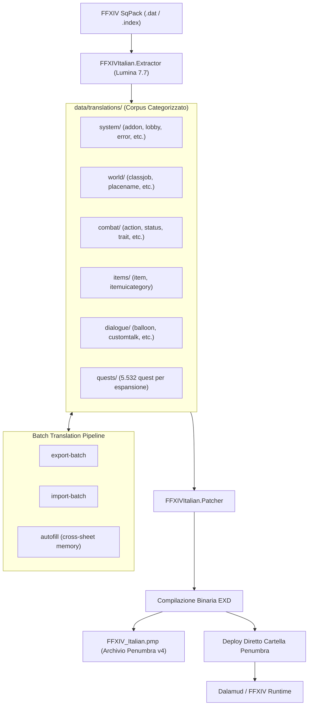

# Architettura Tecnica: FFXIV Italiano

Questo documento illustra l'architettura software, i flussi di dati e l'ingegneria del sistema di localizzazione per **Final Fantasy XIV**.

---

## 1. Visione d'Insieme della Pipeline



---

## 2. Moduli della Soluzione

### A. `FFXIVItalian.Core`
La libreria di base contenente modelli, astrazioni e validatori:
- **`TranslationPathResolver`**:
  - Risolve automaticamente i nomi dei fogli sia con percorsi piatti legacy che all'interno delle categorie (`system/`, `world/`, `combat/`, `items/`, `dialogue/`, `quests/`).
  - Supporta la scansione ricorsiva di tutti i file JSON e il censimento statistico delle traduzioni.
  - Offre la funzione di categorizzazione automatica (`reorganize`) per spostare i file nella cartella di appartenenza corretta.
- **`TranslationFileReader`**:
  - Carica e analizza i file JSON sia in formato standard a dizionario che in formato specializzato (es. 2-column per le quest con `tag`, `original`, `translation`).
- **`SeString/SeStringValidator`**:
  - Validatore sintattico per tag interni di FFXIV (`<hex:...>`, `<Highlight>`, `<FullName>`, macro condizionali di genere). Rileva tag mancanti o malformati prima della compilazione.
- **`Glossary/GlossaryEngine`**:
  - Motore di coerenza terminologica basato su `07_Glossary.md`. Verifica forme non ammesse o errate (es. *Maelstrom*, *iarde*, ecc.).

---

### B. `FFXIVItalian.Extractor`
Il componente di estrazione ed elaborazione dati:
- **`UniversalSheetExtractor`**:
  - Si interfaccia con **Lumina 7.7** leggendo direttamente gli archivi `SqPack` ufficiali di Final Fantasy XIV.
  - Riconosce dinamicamente tipi di colonne testuali (`SeString`, stringhe semplici) e indici numerici primari, estraendo qualsiasi foglio del gioco senza richiedere codice specifico per foglio.
- **`QuestExtractor`**:
  - Estrae il catalogo completo di tutte le missioni del gioco (oltre 5.500 file di testo narrative).
  - Filtra automaticamente le righe vuote o prive di testo.
  - Organizza i file per espansione (`arr`, `heavensward`, `stormblood`, `shadowbringers`, `endwalker`, `dawntrail`) e cartella numerica (`000`, `001`, ecc.).
- **`BatchManager`**:
  - Gestisce l'esportazione selettiva di righe non tradotte (`export-batch`), l'importazione sicura (`import-batch`), la propagazione di testi ricorrenti (`autofill`) e la visualizzazione dello stato globale (`status`).

---

### C. `FFXIVItalian.Patcher`
Il generatore e distributore della mod:
- **Compilazione Binaria EXD**:
  - Ricostruisce le tabelle binarie EXD secondo la specifica Square Enix (header EXDF, indici di riga, offset e codifica UTF-8/SeString).
- **Integrazione Penumbra v4**:
  - Genera `meta.json` e `default_mod.json` per mappare ogni foglio EXD modificato sul rispettivo percorso virtuale originale.
  - Produce il pacchetto compresso `.pmp`.
  - **Hot-Deploy Diretto**: Copia i binari compilati e i descrittori direttamente nella cartella attiva di Penumbra (configurata in `appsettings.json` o rilevata automaticamente).
- **Sincronizzazione Dalamud**:
  - Verifica e imposta la chiave `IsResumeGameAfterPluginLoad: true` nel file di configurazione di Dalamud (`dalamudConfig.json`), garantendo che il gioco attenda il caricamento completo della mod prima di mostrare la schermata del titolo.

---

### D. `FFXIVItalian.DiffTool`
Strumento per la manutenzione e il monitoraggio degli aggiornamenti di gioco:
- **Hashing a Livello di Cella**: Confronta snapshot tra diverse versioni del gioco per identificare istantaneamente nuove righe (`[NEW]`) o modifiche (`[MODIFIED]`), proteggendo le traduzioni esistenti senza dover rielaborare l'intero database.

---

## 3. Organizzazione del Corpus (`data/translations/`)

I file di traduzione sono suddivisi logicamente per dominio di gioco:

| Categoria | Descrizione | Fogli Principali |
|---|---|---|
| `system/` | Interfaccia utente, schermate di sistema e comandi | `addon.json`, `lobby.json`, `error.json`, `maincommand.json`, `howto.json`, `textcommand.json`, `logmessage.json` |
| `world/` | Elementi del mondo, geografia, personaggi e clan | `classjob.json`, `race.json`, `tribe.json`, `placename.json`, `fate.json`, `achievement.json`, `title.json`, `weather.json` |
| `combat/` | Abilità, stati alterati e tratti di combattimento | `action.json`, `actiontransient.json`, `status.json`, `trait.json`, `traittransient.json` |
| `items/` | Oggetti, equipaggiamento e categorie UI | `item.json`, `itemuicategory.json` |
| `dialogue/` | Testi ambientali, fumetti e dialoghi generici | `balloon.json`, `customtalk.json`, `defaulttalk.json` |
| `quests/` | Trame narrative, cutscene e dialoghi delle missioni | Suddivise per espansione (`arr`, `heavensward`, `stormblood`, `shadowbringers`, `endwalker`, `dawntrail`) |

---

## 4. Gestione di Nuove Patch ed Espansioni

Quando Square Enix pubblica una nuova patch o espansione:

1. **Riestrazione o aggiornamento incrementale**:
   ```powershell
   dotnet run --project src/FFXIVItalian.Extractor -- extract
   ```
   Il sistema aggiorna il corpus: le righe già tradotte in italiano rimangono intatte, mentre le nuove righe in lingua inglese vengono aggiunte come pendenti.
2. **Controllo con il cruscotto**:
   ```powershell
   dotnet run --project src/FFXIVItalian.Extractor -- status
   ```
   Le nuove righe compaiono immediatamente come pendenti nel conteggio della categoria appropriata.
3. **Traduzione incrementale a batch**:
   È possibile esportare solo le righe nuove della patch ed importarle senza rischiare regressioni sul testo pregresso.
4. **Rebuild della mod**:
   ```powershell
   .\rebuild.bat
   ```
   I file binari EXD vengono ricompilati in pochi secondi con le nuove stringhe pronte in-game.
