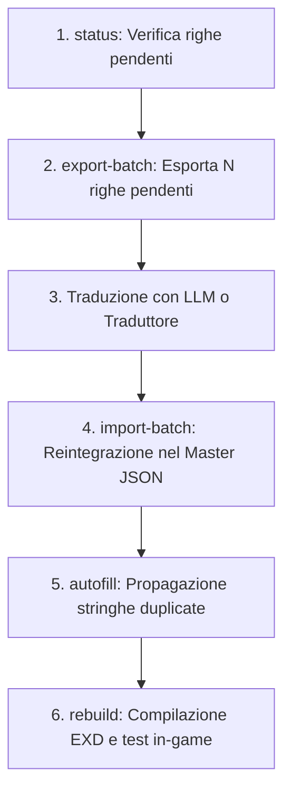

# Guida Operativa alla Traduzione a Batch (Batch Translation Workflow)

Questo documento descrive il flusso di lavoro standard per tradurre in maniera strutturata, scalabile e priva di allucinazioni i testi di **Final Fantasy XIV**, mantenendo la coerenza stilistica e l'integrità dei tag SeString.

---

## 1. Perché l'approccio a Batch?

Il corpus testuale di FFXIV conta oltre 433.000 righe. Caricare file JSON di decine di migliaia di righe direttamente nei modelli linguistici (LLM) comporta:
- Consumo sproporzionato e inutile di token di contesto.
- Rischio di troncamento del file di output.
- Perdita o corruzione di tag esadecimali di controllo `<hex:...>`.
- Possibile sovrascrittura di traduzioni preesistenti.

Il sistema `BatchManager` integrato in `FFXIVItalian.Extractor` risolve questi problemi isolando porzioni gestibili di righe pendenti e consentendo l'importazione atomica e sicura.

---

## 2. Il Ciclo di Lavoro Passo-Passo



---

## 3. Comandi Dettagliati

### Passo 1: Controllare lo Stato (`status`)
Eseguire il comando di stato per identificare quale foglio o categoria ha righe da tradurre:
```powershell
dotnet run --project src/FFXIVItalian.Extractor -- status
```
La dashboard mostrerà le categorie (`SYSTEM`, `WORLD`, `COMBAT`, `ITEMS`, `DIALOGUE`, `QUESTS`) con il conteggio delle righe completate e pendenti.

---

### Passo 2: Esportare un Batch (`export-batch`)
Selezionare il foglio desiderato ed esportare un blocco di righe.

```powershell
# Esempio: Esporta 100 righe non tradotte dal foglio 'addon'
dotnet run --project src/FFXIVItalian.Extractor -- export-batch addon --limit 100
```
- Il file verrà creato in `data/batches/<sheet>_batch_<timestamp>.json`.
- Se si desidera specificare un file di destinazione personalizzato:
  ```powershell
  dotnet run --project src/FFXIVItalian.Extractor -- export-batch addon --limit 50 --out data/batches/mio_batch.json
  ```

Il file esportato ha una struttura semplificata e leggera:
```json
{
  "Sheet": "addon",
  "ExportDate": "2026-09-19T15:54:02.1234567+02:00",
  "TotalRows": 100,
  "Rows": [
    {
      "Key": "1234#Text",
      "Original": "Are you sure you want to proceed?",
      "Translation": ""
    }
  ]
}
```

---

### Passo 3: Traduzione del Batch
La traduzione del file batch può essere eseguita tramite un LLM o manualmente:
- Fornire al modello di traduzione il contenuto di [docs/TRANSLATION_PROMPT.md](file:///docs/TRANSLATION_PROMPT.md).
- Fare riferimento a [docs/STYLE_GUIDE.md](file:///docs/STYLE_GUIDE.md) e [data/glossary/07_Glossary.md](file:///data/glossary/07_Glossary.md).
- **Regole Fondamentali**:
  1. Compilare unicamente il campo `"Translation"`, lasciando inalterati `"Key"` e `"Original"`.
  2. Preservare in modo categorico e identico qualsiasi tag esadecimale o macro come `<hex:0209020203>`, `<Highlight>`, `<FullName>`, `\uE051`, ecc.
  3. Non inventare o tradurre termini propri di Square Enix non presenti nel canone.

---

### Passo 4: Importare il Batch Tradotto (`import-batch`)
Una volta completata la traduzione del batch JSON:

```powershell
dotnet run --project src/FFXIVItalian.Extractor -- import-batch addon data/batches/addon_batch_XXXXX.json
```
- Il sistema individua automaticamente il foglio corretto (anche all'interno delle sottocartelle `system/`, `world/`, ecc.).
- Applica solo le traduzioni valide non vuote.
- Salva il file master mantenendo la formattazione indentata.

---

### Passo 5: Propagazione Automatica (`autofill`)
In FFXIV molte stringhe (nomi di elementi di menu, opzioni di conferma come "Yes"/"No", stati o categorie) si ripetono decine o centinaia di volte in fogli diversi.

Il comando `autofill` analizza tutte le traduzioni già approvate nel progetto e popola automaticamente le righe identiche ancora vuote:
```powershell
dotnet run --project src/FFXIVItalian.Extractor -- autofill
```
Questo garantisce coerenza terminologica immediata a costo zero di token.

---

### Passo 6: Ricompilare e Testare In-Game
Dopo ogni importazione, ricompilare il pacchetto mod:
```powershell
.\rebuild.bat
```
Il patcher ricompila i binari `.exd`, rigenera `FFXIV_Italian.pmp` e sincronizza la cartella di Penumbra. È sufficiente riavviare FFXIV (o ricaricare la mod da Penumbra) per visualizzare i nuovi testi in-game.

---

## 4. Pulizia e Manutenzione
I file all'interno di `data/batches/` sono temporanei:
- Una volta importati con successo nel master JSON e verificati, possono essere eliminati in sicurezza.
- La cartella `data/batches/` è predisposta con `.gitkeep` per rimanere disponibile all'interno del repository.
