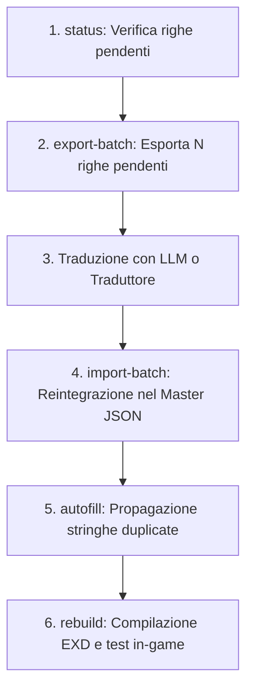
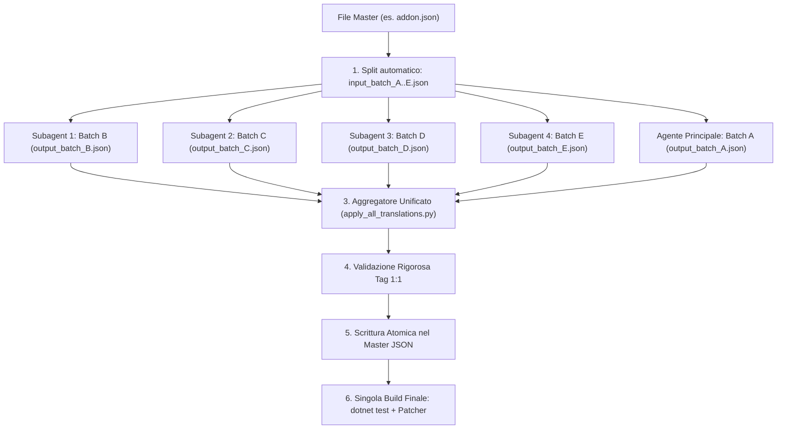

# Guida Operativa alla Traduzione a Batch (Batch Translation Workflow)

Questo documento descrive il flusso di lavoro standard per tradurre in maniera strutturata, scalabile e priva di allucinazioni i testi di **Final Fantasy XIV**, mantenendo la coerenza stilistica e l'integrità dei tag SeString.

---

## 1. Perché l'approccio a Batch?

Il corpus testuale di FFXIV conta oltre 433.000 righe. Caricare file JSON di decine di migliaia di righe direttamente nei modelli linguistici (LLM) comporta:
- Consumo sproporzionato e inutile di token di contesto.
- Rischio di troncamento del file di output.
- Perdita o corruzione di tag esadecimali di controllo `<hex:...>`.
- Possibile sovrascrittura di traduzioni preesistenti.

Il sistema `BatchManager` integrato in `FFXIVItalian.Extractor` risolve questi problemi isolando porzioni gestibili di righe pendenti e consentendo l'importazione atomica e sicura.

---

## 2. Il Ciclo di Lavoro Passo-Passo



---

## 3. Comandi Dettagliati

### Passo 1: Controllare lo Stato (`status`)
Eseguire il comando di stato per identificare quale foglio o categoria ha righe da tradurre:
```powershell
dotnet run --project src/FFXIVItalian.Extractor -- status
```
La dashboard mostrerà le categorie (`SYSTEM`, `WORLD`, `COMBAT`, `ITEMS`, `DIALOGUE`, `QUESTS`) con il conteggio delle righe completate e pendenti.

---

### Passo 2: Esportare un Batch (`export-batch`)
Selezionare il foglio desiderato ed esportare un blocco di righe.

```powershell
# Esempio: Esporta 100 righe non tradotte dal foglio 'addon'
dotnet run --project src/FFXIVItalian.Extractor -- export-batch addon --limit 100
```
- Il file verrà creato in `data/batches/<sheet>_batch_<timestamp>.json`.
- Se si desidera specificare un file di destinazione personalizzato:
  ```powershell
  dotnet run --project src/FFXIVItalian.Extractor -- export-batch addon --limit 50 --out data/batches/mio_batch.json
  ```

Il file esportato ha una struttura semplificata e leggera:
```json
{
  "Sheet": "addon",
  "ExportDate": "2026-09-19T15:54:02.1234567+02:00",
  "TotalRows": 100,
  "Rows": [
    {
      "Key": "1234#Text",
      "Original": "Are you sure you want to proceed?",
      "Translation": ""
    }
  ]
}
```

---

### Passo 3: Traduzione del Batch
La traduzione del file batch può essere eseguita tramite un LLM o manualmente:
- Fornire al modello di traduzione il contenuto di [docs/TRANSLATION_PROMPT.md](file:///docs/TRANSLATION_PROMPT.md).
- Fare riferimento a [docs/STYLE_GUIDE.md](file:///docs/STYLE_GUIDE.md) e [data/glossary/07_Glossary.md](file:///data/glossary/07_Glossary.md).
- **Regole Fondamentali**:
  1. Compilare unicamente il campo `"Translation"`, lasciando inalterati `"Key"` e `"Original"`.
  2. Preservare in modo categorico e identico qualsiasi tag esadecimale o macro come `<hex:0209020203>`, `<Highlight>`, `<FullName>`, `\uE051`, ecc.
  3. Non inventare o tradurre termini propri di Square Enix non presenti nel canone.

---

### Passo 4: Importare il Batch Tradotto (`import-batch`)
Una volta completata la traduzione del batch JSON:

```powershell
dotnet run --project src/FFXIVItalian.Extractor -- import-batch addon data/batches/addon_batch_XXXXX.json
```
- Il sistema individua automaticamente il foglio corretto (anche all'interno delle sottocartelle `system/`, `world/`, ecc.).
- Applica solo le traduzioni valide non vuote.
- Salva il file master mantenendo la formattazione indentata.

---

### Passo 5: Propagazione Automatica (`autofill`)
In FFXIV molte stringhe (nomi di elementi di menu, opzioni di conferma come "Yes"/"No", stati o categorie) si ripetono decine o centinaia di volte in fogli diversi.

Il comando `autofill` analizza tutte le traduzioni già approvate nel progetto e popola automaticamente le righe identiche ancora vuote:
```powershell
dotnet run --project src/FFXIVItalian.Extractor -- autofill
```
Questo garantisce coerenza terminologica immediata a costo zero di token.

---

### Passo 6: Ricompilare e Testare In-Game
Dopo ogni importazione, ricompilare il pacchetto mod:
```powershell
.\rebuild.bat
```
Il patcher ricompila i binari `.exd`, rigenera `FFXIV_Italian.pmp` e sincronizza la cartella di Penumbra. È sufficiente riavviare FFXIV (o ricaricare la mod da Penumbra) per visualizzare i nuovi testi in-game.

---

## 4. Pulizia e Manutenzione
I file all'interno di `data/batches/` o cartelle scratch temporanee sono transitori:
- Una volta importati con successo nel master JSON e verificati, possono essere eliminati in sicurezza.
- La cartella `data/batches/` è predisposta con `.gitkeep` per rimanere disponibile all'interno del repository.

---

## 5. Architettura Parallela Avanzata con Subagenti (Parallel Subagents Workflow)

Quando si affrontano fogli molto corposi (es. `addon.json` con 15.000 righe, o blocchi di migliaia di righe non tradotte), tradurre in micro-chunk sequenziali (150-200 righe per volta con continue ricompilazioni `dotnet test` e roundtrip di chat) genera un consumo sproporzionato di token di contesto nell'agente principale e rallenta il processo.

L'**Architettura Parallela con Subagenti** permette di elaborare migliaia di stringhe simultaneamente in un unico ciclo pulito:



### I 5 Principi della Tecnica

1. **Partizionamento Isolato (Zero Conflitti di Scrittura)**:
   - I subagenti **NON toccano mai** il file master (`addon.json`).
   - Ogni subagent legge un file di input dedicato (`input_batch_X.json`) e scrive unicamente il proprio file di output (`output_batch_X.json`) come dizionario `{ "id": "traduzione" }`.
   - Dimensionamento ideale dei batch: **500–700 elementi** per subagent.

2. **Prompt Standalone e Rigoroso per i Subagenti**:
   Ciascun subagent riceve un prompt vincolante e autosufficiente:
   - **Nessun bilinguismo a schermo**: vietato `Italiano (Inglese)`.
   - **Termini non traducibili**: nomi di abilità, magie, Limit Break e comandi slash (`/`) rimangono categoricamente in **inglese**.
   - **Conformità SeString**: conservazione byte-per-byte e ordine 1:1 di tutti i tag `<hex:...>`.
   - **Auto-validazione obbligatoria**: il subagent deve verificare con script Python che `re.findall(r'<hex:[0-9A-Fa-f]+>', orig) == re.findall(r'<hex:[0-9A-Fa-f]+>', trans)` prima di scrivere il file finale.
   - **Nessuna build intermedia**: i subagenti non devono lanciare `dotnet test` né compilare pacchetti.

3. **Esecuzione Concorrente Senza Polling**:
   - L'agente principale invoca contemporaneamente i subagenti tramite `invoke_subagent` (usando `self` per ereditare i tool di scrittura e script).
   - Mentre i subagenti lavorano in background, l'agente principale traduce in parallelo il proprio chunk (es. Batch A).
   - Il sistema di messaggistica riattiva reattivamente l'agente principale al completamento di ciascun subagent (nessun ciclo di polling attivo che sprecherebbe token).

4. **Aggregatore e Validatore Unificato**:
   Una volta completati tutti i batch, viene eseguito uno script Python centrale (`apply_all_translations.py`):
   - Verifica la presenza di tutti i file `output_batch_*.json`.
   - Esegue una validazione globale al 100% dell'integrità di tutti i tag SeString su ogni singola voce.
   - Applica tutte le migliaia di traduzioni nel master JSON in un'unica scrittura atomica.
   - Conferma che le voci prive di traduzione siano scese a zero.

5. **Build Unica e Test Finale**:
   - Unico ciclo di test automatici: `dotnet test` (tutti i test verdi).
   - Unica esecuzione di `FFXIVItalian.Patcher` (o `rebuild.bat`) per generare tutti i file `.exd` e distribuirli direttamente nella cartella di Penumbra.
   - Pulizia automatica dei file scratch e commit Git atomico.

---

### Script Riutilizzabili (Disponibili in `scripts/`)

Gli script per la gestione automatizzata dei lotti sono pronti all'uso nella cartella `scripts/` del repository.

#### A. Script di Partizionamento (`scripts/split_untranslated.py`)
```bash
python scripts/split_untranslated.py <master_json> --batch-size 500 --out-dir scratch
```
import json, os, sys

def split_file(json_path, batch_size=600, out_dir="scratch"):
    os.makedirs(out_dir, exist_ok=True)
    with open(json_path, 'r', encoding='utf-8') as f:
        data = json.load(f)

    # Identifica chiavi non tradotte
    untrans = {k: v['original'] for k, v in data.items() if not v.get('translation')}
    print(f"Voci non tradotte totali: {len(untrans)}")
    
    keys = sorted(int(k) for k in untrans.keys())
    batch_names = "ABCDEFGHIJKLMNOPQRSTUVWXYZ"
    for i in range(0, len(keys), batch_size):
        chunk_keys = keys[i:i + batch_size]
        batch_id = batch_names[i // batch_size]
        chunk_dict = {str(k): untrans[str(k)] for k in chunk_keys}
        out_path = os.path.join(out_dir, f"input_batch_{batch_id}.json")
        with open(out_path, 'w', encoding='utf-8') as out:
            json.dump(chunk_dict, out, ensure_ascii=False, indent=2)
        print(f"Batch {batch_id}: {len(chunk_dict)} voci -> {out_path}")
```

#### B. Template di Prompt per i Subagenti
```text
Sei il Traduttore di FFXIV per il Batch {BATCH_NAME}.
File di input: {INPUT_PATH} ({N} voci).
File di output da creare: {OUTPUT_PATH}.

Regole vincolanti:
1. Traduci tutte le stringhe in italiano di registro fantasy MMORPG naturale.
2. MAI testo bilingue a schermo (vietato "Italiano (Inglese)").
3. Mantieni in inglese nomi di abilità, magie, Limit Break e comandi slash (es. /gpose, Provoke).
4. Rispetta rigorosamente docs/STYLE_GUIDE.md e data/glossary/07_Glossary.md.
5. Preserva identici in conteggio, ordine e contenuto tutti i tag SeString <hex:...>.
6. Valida le traduzioni con script Python prima di salvarle:
   re.findall(r'<hex:[0-9A-Fa-f]+>', orig) == re.findall(r'<hex:[0-9A-Fa-f]+>', trans)
7. NON modificare i file master del progetto e NON eseguire test o build dotnet.
Scrivi solo {OUTPUT_PATH} e notifica al completamento con il totale delle voci tradotte.
```

#### C. Script di Aggregazione e Validazione (`scripts/apply_all_translations.py`)
```bash
python scripts/apply_all_translations.py <master_json> --batch-dir scratch
```
import json, os, re, sys

def extract_tags(s):
    return re.findall(r'<hex:[0-9A-Fa-f]+>', s)

def apply_batches(master_json_path, batch_dir="scratch", batch_ids=None):
    if batch_ids is None:
        batch_ids = ['A', 'B', 'C', 'D', 'E']
        
    all_trans = {}
    for b in batch_ids:
        fpath = os.path.join(batch_dir, f"output_batch_{b}.json")
        if not os.path.exists(fpath):
            print(f"ERRORE: Manca {fpath}")
            sys.exit(1)
        with open(fpath, 'r', encoding='utf-8') as f:
            all_trans.update(json.load(f))
            
    with open(master_json_path, 'r', encoding='utf-8') as f:
        master = json.load(f)
        
    # Validazione rigorosa tag
    errors = []
    for k_str, trans in all_trans.items():
        if k_str not in master:
            errors.append(f"Chiave {k_str} non presente nel master")
            continue
        orig = master[k_str]['original']
        if extract_tags(orig) != extract_tags(trans):
            errors.append(f"Tag mismatch alla chiave {k_str}")
            
    if errors:
        print(f"Trovati {len(errors)} errori di validazione!")
        sys.exit(1)
        
    # Applicazione atomica
    for k_str, trans in all_trans.items():
        master[k_str]['translation'] = trans
        
    with open(master_json_path, 'w', encoding='utf-8') as f:
        json.dump(master, f, ensure_ascii=False, indent=2)
        
    print(f"Applicate con successo {len(all_trans)} traduzioni al master!")
```


